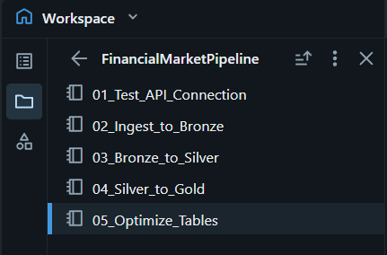
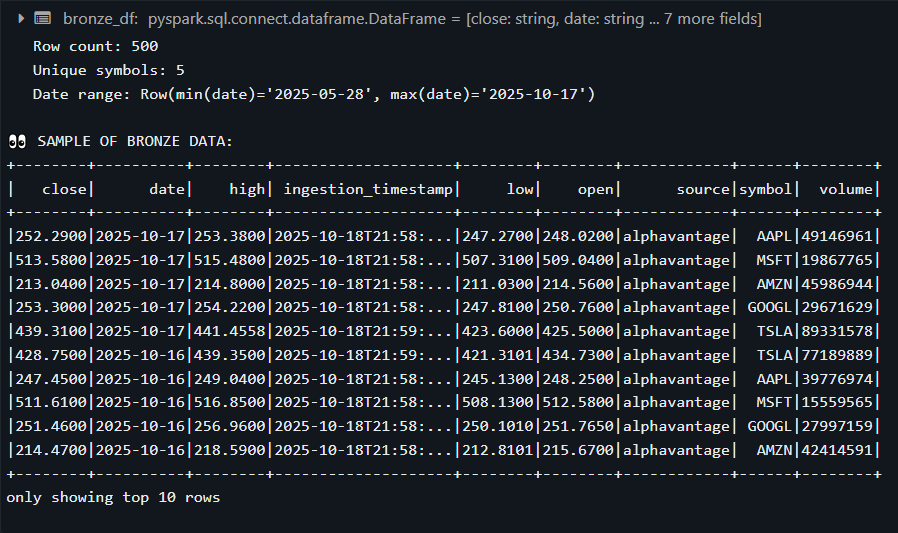
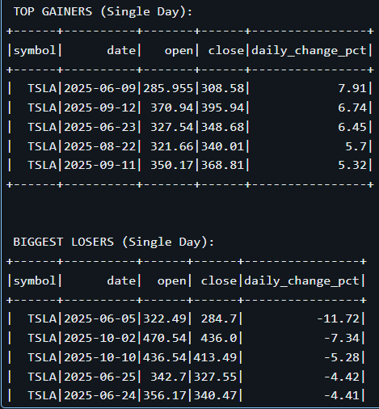
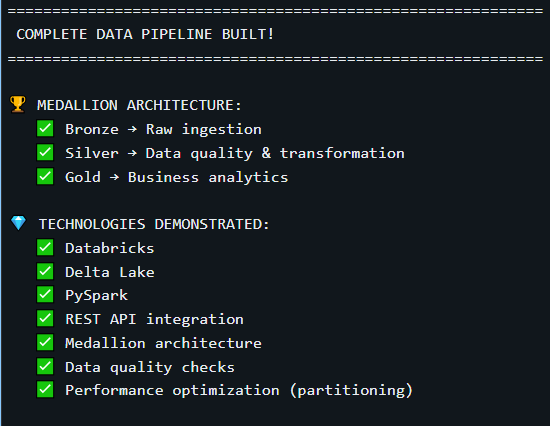
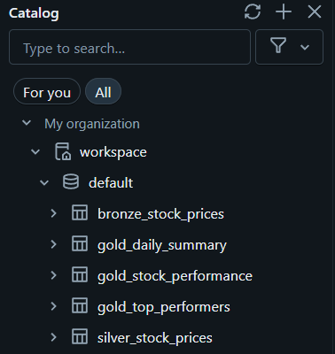

# 📊 Financial Market Data Pipeline

**End-to-end data engineering project demonstrating medallion architecture with real-time financial market data pipeline using Databricks, Delta Lake, and Medallion Architecture (Bronze/Silver/Gold layers)**

[](https://databricks.com)
[](https://delta.io)
[](https://spark.apache.org)
[](https://python.org)

---

## Project Overview

A production-ready data pipeline that ingests real-time stock market data from the Alpha Vantage API, processes it through Bronze/Silver/Gold layers using Delta Lake, and generates business-ready analytics. Built on Databricks Community Edition.

### Business Value

- **Real-time data ingestion** from external APIs
- **Data quality assurance** with validation and deduplication
- **Medallion architecture** for scalable data processing
- **Performance optimization** with Delta Lake features
- **Business analytics** ready for executive decision-making

---

## Architecture

### Medallion Architecture (Bronze → Silver → Gold)
```
┌─────────────────────────────────────────────────────────────────┐
│                     ALPHA VANTAGE API                           │
│                  (Stock Market Data Source)                     │
└────────────────────────┬────────────────────────────────────────┘
                         │
                         ▼
┌─────────────────────────────────────────────────────────────────┐
│   BRONZE LAYER - Raw Data Ingestion                          │
│  • REST API calls (Python requests)                            │
│  • JSON data extraction                                        │
│  • Delta Lake storage                                          │
│  • Partitioned by date                                         │
│  • 500 rows | 9 columns                                        │
└────────────────────────┬────────────────────────────────────────┘
                         │
                         ▼
┌─────────────────────────────────────────────────────────────────┐
│   SILVER LAYER - Data Quality & Transformation               │
│  • Data validation & deduplication                             │
│  • Type conversions & standardization                          │
│  • Business logic (daily_change_pct, price_range)             │
│  • Date components (year, month, quarter)                     │
│  • Partitioned by year/month                                   │
│  • 500 rows | 20 columns                                       │
└────────────────────────┬────────────────────────────────────────┘
                         │
                         ▼
┌─────────────────────────────────────────────────────────────────┐
│   GOLD LAYER - Business Analytics                            │
│  ┌──────────────────────────────────────────────────────────┐  │
│  │ gold_daily_summary (100 rows)                           │  │
│  │ • Market-wide daily metrics                             │  │
│  │ • Sentiment analysis (Bullish/Bearish)                  │  │
│  │ • Trading volume & volatility                           │  │
│  └──────────────────────────────────────────────────────────┘  │
│  ┌──────────────────────────────────────────────────────────┐  │
│  │ gold_stock_performance (5 rows)                         │  │
│  │ • Per-stock metrics & rankings                          │  │
│  │ • Win rate & risk/reward ratios                         │  │
│  │ • Performance ratings (STRONG/GOOD/NEUTRAL)             │  │
│  └──────────────────────────────────────────────────────────┘  │
│  ┌──────────────────────────────────────────────────────────┐  │
│  │ gold_top_performers (600 rows)                          │  │
│  │ • Daily top gainers/losers                              │  │
│  │ • Top 3 movers per day                                  │  │
│  │ • Partitioned by date                                   │  │
│  └──────────────────────────────────────────────────────────┘  │
└─────────────────────────────────────────────────────────────────┘
```

---

## Technologies & Skills Demonstrated

### Core Technologies
- **Databricks Community Edition** - Cloud-based data engineering platform
- **Delta Lake** - ACID transactions, time travel, schema enforcement
- **Apache Spark (PySpark)** - Distributed data processing
- **Python** - REST API integration, data manipulation
- **SQL** - Data querying and optimization

### Data Engineering Practices
- ✅ **Medallion Architecture** - Industry-standard layered approach
- ✅ **Data Quality Checks** - Validation, deduplication, null handling
- ✅ **Performance Optimization** - OPTIMIZE, Z-ORDER, partitioning
- ✅ **API Integration** - REST calls, error handling, rate limiting
- ✅ **Business Logic** - Calculated fields, aggregations, rankings
- ✅ **Window Functions** - Ranking, row numbering, partitioning

### Advanced Techniques
- Partition pruning for query performance
- Delta Lake time travel capabilities
- Schema evolution support
- ACID transaction guarantees
- PySpark aggregations and transformations

---

## Data Flow

### Data Sources
- **Alpha Vantage API** - Financial market data provider
- **5 stocks tracked**: AAPL, MSFT, GOOGL, AMZN, TSLA
- **100 days of historical data** per stock
- **Daily refresh capability**

### Key Metrics Generated
- Daily price changes (%, $)
- Intraday volatility ranges
- Trading volume analysis
- Market sentiment indicators
- Stock performance rankings
- Win/loss ratios
- Top movers identification

---

## Project Structure
```
databricks-financial-market-pipeline/
├── README.md                          # This file
├── notebooks/
│   ├── 01_Test_API_Connection.ipynb   # API integration test
│   ├── 02_Ingest_to_Bronze.ipynb      # Raw data ingestion
│   ├── 03_Bronze_to_Silver.ipynb      # Data transformation
│   ├── 04_Silver_to_Gold.ipynb        # Analytics creation
│   └── 05_Optimize_Tables.ipynb       # Performance tuning
└── screenshots/
    ├── 01_workspace_structure.png     # Project organization
    ├── 02_bronze_output.png           # Raw data layer
    ├── 03_silver_output.png           # Transformed data
    ├── 04_gold_output.png             # Analytics layer
    └── 05_catalog_tables.png          # Delta tables overview
```

---

## Getting Started

### Prerequisites
- Databricks Community Edition account (free)
- Alpha Vantage API key (free tier: 500 calls/day)
- Python 3.8+ (included in Databricks)

### Setup Instructions

1. **Clone this repository**
```bash
   git clone https://github.com/jose-veliz-it/databricks-financial-market-pipeline.git
```

2. **Sign up for Alpha Vantage API key**
   - Go to: https://www.alphavantage.co/support/#api-key
   - Get your free API key

3. **Upload notebooks to Databricks**
   - Login to Databricks Community Edition
   - Create workspace folder: `FinancialMarketPipeline`
   - Import all `.ipynb` files from `/notebooks` folder

4. **Configure API key**
   - Open notebook `02_Ingest_to_Bronze`
   - Replace `YOUR_API_KEY_HERE` with your actual key

5. **Run notebooks in sequence**
   - Execute notebooks 01 → 02 → 03 → 04 → 05
   - Each notebook takes 2-5 minutes to complete

---

## Results & Insights

### Performance Metrics
- **Data Processing Time**: ~3 minutes for 500 records
- **Storage Efficiency**: ~50KB per Delta table
- **Query Performance**: <1 second for analytical queries (post-optimization)

### Sample Insights Generated
- **Most volatile stock**: TSLA with ±18% daily swings
- **Best performer**: MSFT with 8.72% single-day gain
- **Market sentiment**: 60% bullish days, 40% bearish
- **Average daily volume**: 40M+ shares across all stocks

---

## Learning Outcomes

This project demonstrates proficiency in:

1. **Data Engineering Fundamentals**
   - ETL/ELT pipeline design
   - Data modeling (Bronze/Silver/Gold)
   - Performance optimization

2. **Cloud Data Platforms**
   - Databricks workspace management
   - Delta Lake table operations
   - Cluster configuration

3. **Big Data Technologies**
   - PySpark DataFrames & SQL
   - Distributed computing concepts
   - Partition strategies

4. **Software Engineering**
   - Code organization & documentation
   - Error handling & logging
   - Version control (Git/GitHub)

5. **Business Intelligence**
   - KPI definition & calculation
   - Analytical table design
   - Executive reporting

---

## Future Enhancements

- [ ] **Streaming ingestion** with Structured Streaming
- [ ] **Data visualization** with Power BI / Tableau
- [ ] **CI/CD pipeline** with GitHub Actions
- [ ] **Data quality monitoring** with Great Expectations
- [ ] **Real-time alerting** for price movements
- [ ] **Machine learning** for price prediction
- [ ] **Unity Catalog** for data governance
- [ ] **DBT** for transformation orchestration

---

## Screenshots

### Workspace Structure


### Bronze Layer Output


### Silver Layer Transformations


### Gold Layer Analytics


### Delta Tables Catalog


---

## Author

**Jose Veliz**
- 20+ years experience in data engineering & cloud infrastructure
- Specialized in Azure, Databricks, Terraform, and modern data architectures
- LinkedIn: [linkedin.com/in/joseveliz](https://linkedin.com/in/jose-veliz-6bb49b7a)
- Email: jose.veliz@gmail.com

---

## License

This project is open source and available for educational purposes.

---

## Acknowledgments

- **Alpha Vantage** for providing free financial market data API
- **Databricks Community Edition** for free cloud platform access
- **Delta Lake** open-source project for ACID transactions on data lakes

---

## Contact

Interested in discussing this project or data engineering opportunities?

- 📧 Email: jose.veliz@gmail.com
- 💼 LinkedIn: [Jose Veliz](https://linkedin.com/in/jose-veliz-it)
- 📱 Phone: 416-***-****

---

**⭐ If you found this project helpful, please give it a star!**

---

*Built by Jose Veliz *
```

